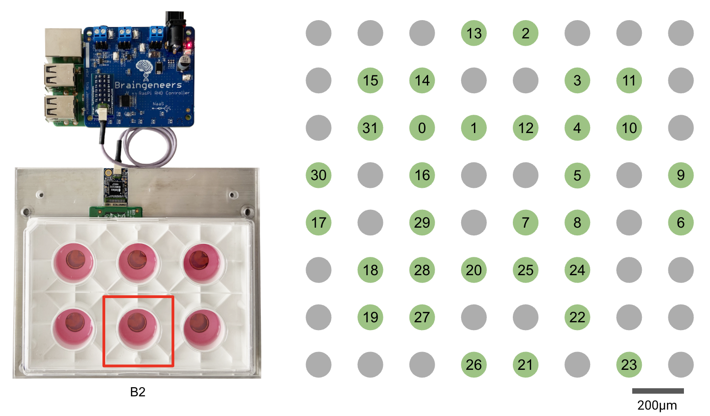

# piphys

Update: The latest manuscript about Piphys has been published in IOP Journal of Neural Engineering!

Peer-reviewed journal article: 

[Light-weight electrophysiology hardware and software platform for cloud-based neural recording experiments](https://iopscience.iop.org/article/10.1088/1741-2552/ac310a/pdf)

The original [preprint](https://www.biorxiv.org/content/10.1101/2021.05.18.444685v2) can still be accessed on bioRxiv.


--------
## Overview

Piphys is an inexpensive open source neurophysiological recording platform based on Raspberry Pi. It is easily accessed and controlled via a standard web interface through Internet of Things (IoT) protocols. 

Piphys modules can be used in a fleet to enable long-term observations of neural development, organization, and activity at scale. 


## Design Files

### Hardware
- Raspberry Pi expansion circuit board for and Intan RHD2000 bioamplifier chip.
- Electrode adapter circuit board for Axion CytoView MEA Plate.

Source files, documentation, and files for manufacturing each circuit board are in [`./Hardware`](https://github.com/braingeneers/piphys/tree/main/Hardware).

#### Electrode mapping



There are 64 electrodes in a well B2 of the Axion CytoView MEA Plate. The electrode adapter circuit board allows 32 of the 64 electrodes to be recorded by Piphys. The green dots are the recorded channels, labeled with their channel number in the data file sampling sequence.

### Mechanical
CAD files in for the electrode plate holder are in [`./Mechanical/AxionPlateHolder`](https://github.com/braingeneers/piphys/tree/main/Mechanical/AxionPlateHolder).

Assembly Order:
```
AxionPlateHolder_CNC_ClampTop_Aluminum
---------------------------------------
[Axion CytoView MEA Plate]
---------------------------------------
AxionPlateHolder_CNC_ClampBottom_Plastic
AxionPlateHolder_CNC_ClampBottom_Aluminum
```

### Software
Software to enable voltage sampling and user interaction, with accompanying documentation are in [`./Software`](https://github.com/braingeneers/piphys/tree/main/Software).

See [`braingeneerpy`](https://github.com/braingeneers/braingeneerspy) Python package for IoT communication library.


### Test Data
System validation data with sine wave are available at the Piphys [`Google Drive folder`](https://drive.google.com/drive/folders/1S5Uj3old0Q09hUaioH9NGgg6K85ICtAz?usp=sharing).


----
### UC Santa Cruz (UCSC) Noncommercial License

Acceptance

In order to get any license under these terms, you must agree to them as both strict obligations and conditions to all your licenses.

Copyright License

The licensor grants you a copyright license for the repository to do everything you might do with the repository that would otherwise infringe the licensor's copyright in it for any permitted purpose.

Notices

You must ensure that anyone who gets a copy of any part of the repository from you also gets a copy of these terms, as well as the following copyright notice:

This repository is Copyright © 2021. The Regents of the University of California (“Regents”). All Rights Reserved.

Noncommercial Purposes

Any noncommercial purpose is a permitted purpose.

Commercial Purposes

Contact Innovation Transfer, UC Santa Cruz, techno@ucsc.edu , https://officeofresearch.ucsc.edu/iatc/ , for any commercial purpose.

Personal Uses

Personal use for research, experiment, and testing for the benefit of public knowledge, personal study, private entertainment, hobby projects, amateur pursuits, or religious observance, without any anticipated commercial application, is use for a permitted purpose.

Noncommercial Organizations

Use by any charitable organization, educational institution, public research organization, public safety or health organization, environmental protection organization, or government institution is use for a permitted purpose regardless of the source of funding or obligations resulting from the funding.

Fair Use

You may have "fair use" rights for the repository under the law. These terms do not limit them.

No Other Rights

These terms do not allow you to sublicense or transfer any of your licenses to anyone else, or prevent the licensor from granting licenses to anyone else.  These terms do not imply any other licenses.

Patent Defense

If you make any written claim that the repository infringes or contributes to infringement of any patent, all your licenses for the repository granted under these terms end immediately. If your company makes such a claim, all your licenses end immediately for work on behalf of your company.

Violations

The first time you are notified in writing that you have violated any of these terms, or done anything with the repository not covered by your licenses, your licenses can nonetheless continue if you come into full compliance with these terms, and take practical steps to correct past violations, within 32 days of receiving notice.  Otherwise, all your licenses end immediately.

No Liability

As far as the law allows, the repository comes as is, without any warranty or condition, and the licensor will not be liable to you for any damages arising out of these terms or the use or nature of the repository, under any kind of legal claim.

Definitions

The "licensor" is Regents, and the "repository" is the repository the licensor makes available under these terms.

"You" refers to the individual or entity agreeing to these terms.

"Your company" is any legal entity, sole proprietorship, or other kind of organization that you work for, plus all organizations that have control over, are under the control of, or are under common control with that organization.  

"Control" means ownership of substantially all the assets of an entity, or the power to direct its management and policies by vote, contract, or otherwise.  Control can be direct or indirect.

"Your licenses" are all the licenses granted to you for the repository under these terms.

"Use" means anything you do with the repository requiring one of your licenses.

© 2021 Braingeneers
